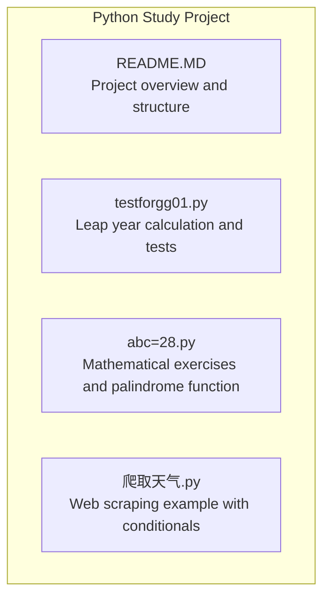
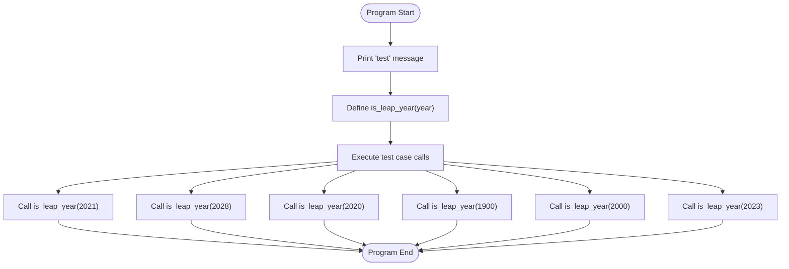
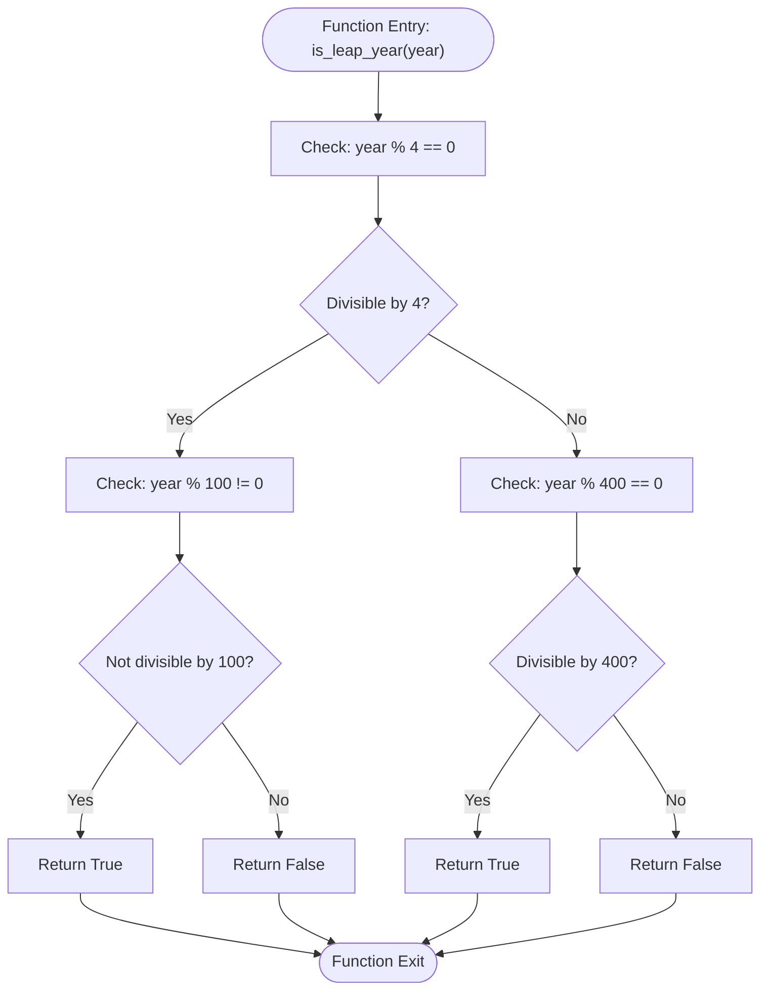
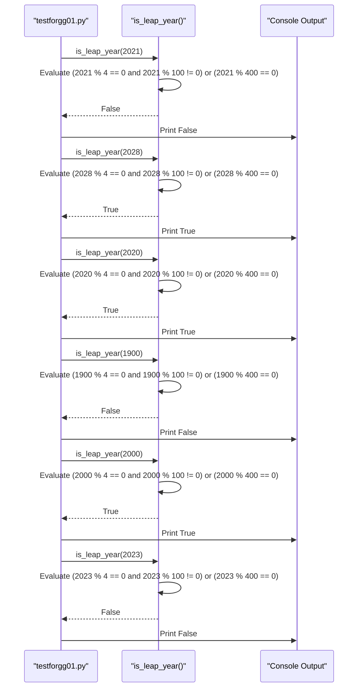
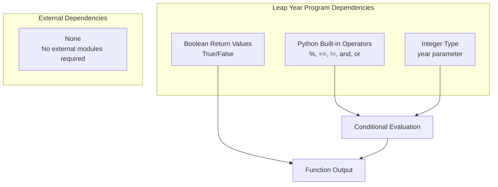

# Conditional Logic

<cite>
**Referenced Files in This Document**
- [testforgg01.py](file://testforgg01.py)
- [README.MD](file://README.MD)
- [abc=28.py](file://abc=28.py)
- [爬取天气.py](file://爬取天气.py)
</cite>

## Table of Contents
1. [Introduction](#introduction)
2. [Project Structure](#project-structure)
3. [Core Components](#core-components)
4. [Architecture Overview](#architecture-overview)
5. [Detailed Component Analysis](#detailed-component-analysis)
6. [Dependency Analysis](#dependency-analysis)
7. [Performance Considerations](#performance-considerations)
8. [Troubleshooting Guide](#troubleshooting-guide)
9. [Conclusion](#conclusion)

## Introduction
This document focuses on the conditional logic implementation in the leap year calculation program within the testforgg01.py script. It explains the leap year determination algorithm, documents the decision-making structures and boolean logic, and demonstrates a practical testing approach with multiple test cases. The goal is to provide clear, accessible documentation for developers learning conditional logic patterns in Python, particularly around date-related calculations.

## Project Structure
The project is a small learning-oriented Python study repository containing several scripts. The leap year logic resides in a dedicated script alongside other exercises and examples.

**Diagram sources**
- [README.MD:1-67](file://README.MD#L1-L67)
- [testforgg01.py:1-21](file://testforgg01.py#L1-L21)
- [abc=28.py:1-33](file://abc=28.py#L1-L33)
- [爬取天气.py:1-36](file://爬取天气.py#L1-L36)

**Section sources**
- [README.MD:5-21](file://README.MD#L5-L21)
- [testforgg01.py:1-21](file://testforgg01.py#L1-L21)

## Core Components
The core component for this documentation is the leap year function and its associated test cases. The function encapsulates the leap year algorithm using a single conditional expression that evaluates two distinct conditions combined with logical operators.

Key elements:
- Function definition with a single parameter representing the year
- Boolean logic combining modulo operations with logical AND/OR
- Explicit return values for True and False outcomes
- Inline test cases demonstrating various input scenarios

**Section sources**
- [testforgg01.py:3-12](file://testforgg01.py#L3-L12)
- [testforgg01.py:14-20](file://testforgg01.py#L14-L20)

## Architecture Overview
The leap year program follows a straightforward functional architecture with minimal dependencies. The main flow consists of function definition, parameter handling, conditional evaluation, and result printing.

**Diagram sources**
- [testforgg01.py:1-21](file://testforgg01.py#L1-L21)

## Detailed Component Analysis

### Leap Year Function Implementation
The leap year function implements the standard Gregorian calendar rule using a single conditional statement. The algorithm evaluates two mutually exclusive conditions connected by logical OR.

**Diagram sources**
- [testforgg01.py:3-12](file://testforgg01.py#L3-L12)

#### Algorithm Breakdown
The leap year rule consists of two primary conditions:
1. **Primary condition**: The year must be divisible by 4 AND not divisible by 100
2. **Secondary condition**: The year must be divisible by 400

These conditions are combined with logical OR, meaning if either condition is true, the year is leap year.

#### Parameter Handling
The function accepts a single integer parameter representing the year. The parameter is used directly in modulo operations without explicit validation or conversion, relying on Python's built-in type coercion for numeric operations.

#### Return Value Processing
The function returns explicit boolean values (True/False) based on the conditional evaluation. These return values are captured by the print statements in the test section, which display the boolean results.

**Section sources**
- [testforgg01.py:3-12](file://testforgg01.py#L3-L12)

### Test Case Validation Approach
The script includes six test cases covering different categories of years to validate the leap year logic comprehensively.

**Diagram sources**
- [testforgg01.py:14-20](file://testforgg01.py#L14-L20)

#### Test Case Categories
The test suite covers representative scenarios:
- **Non-leap year (divisible by 4 but also by 100)**: 1900
- **Leap year (divisible by 4 but not by 100)**: 2020, 2028
- **Leap year (divisible by 400)**: 2000
- **Non-leap year (not divisible by 4)**: 2021, 2023

Each test case validates a specific aspect of the leap year rule, ensuring comprehensive coverage of the conditional logic.

**Section sources**
- [testforgg01.py:14-20](file://testforgg01.py#L14-L20)

### Related Conditional Logic Patterns
While the leap year function uses a single conditional statement, other scripts in the project demonstrate different conditional logic patterns that complement the learning experience.

#### Mathematical Exercise Conditionals
The mathematical exercise script demonstrates nested loops with multiple conditional checks, showing how complex logic can be structured using nested if statements and continue statements.

#### Web Scraping Conditionals
The weather scraping script illustrates conditional logic in real-world applications, including HTTP response status checking, element existence verification, and data extraction based on conditional branches.

**Section sources**
- [abc=28.py:16-23](file://abc=28.py#L16-L23)
- [爬取天气.py:13-32](file://爬取天气.py#L13-L32)

## Dependency Analysis
The leap year program has minimal dependencies, relying primarily on Python's built-in arithmetic and comparison operators. The function does not require external libraries or modules.

**Diagram sources**
- [testforgg01.py:3-12](file://testforgg01.py#L3-L12)

**Section sources**
- [testforgg01.py:3-12](file://testforgg01.py#L3-L12)

## Performance Considerations
The leap year calculation is computationally trivial, involving only four arithmetic operations and two logical comparisons. Performance characteristics:
- **Time Complexity**: O(1) - constant time regardless of input
- **Space Complexity**: O(1) - constant space usage
- **Execution Speed**: Extremely fast due to simple arithmetic operations
- **Memory Usage**: Minimal overhead from function call stack

The simplicity of the algorithm makes it suitable for educational purposes and demonstrates efficient conditional logic implementation.

## Troubleshooting Guide

### Common Issues and Solutions
1. **Incorrect Year Input Type**
   - Problem: Passing non-numeric values to the function
   - Solution: Ensure the parameter is an integer or convertable numeric type

2. **Logic Order Confusion**
   - Problem: Misunderstanding the precedence of logical operators
   - Solution: Use parentheses to clarify the intended order of evaluation

3. **Edge Case Testing**
   - Problem: Missing boundary year validation (1900, 2000)
   - Solution: Include test cases for years divisible by 100 and 400

4. **Return Value Misinterpretation**
   - Problem: Expecting string output instead of boolean
   - Solution: Understand that the function returns boolean values

### Best Practices Demonstrated
- **Clear Documentation**: The function includes a docstring explaining the leap year rule
- **Comprehensive Testing**: Multiple test cases cover different conditional branches
- **Explicit Return Values**: Direct boolean returns improve code readability
- **Simple Logic Structure**: Single conditional statement reduces complexity

**Section sources**
- [testforgg01.py:4-7](file://testforgg01.py#L4-L7)
- [testforgg01.py:14-20](file://testforgg01.py#L14-L20)

## Conclusion
The testforgg01.py script provides an excellent example of clean, efficient conditional logic implementation for leap year determination. The program demonstrates fundamental concepts including boolean logic, modulo operations, and function design while maintaining simplicity and readability. The comprehensive test suite ensures robust validation of the leap year algorithm across different scenarios.

The implementation serves as a practical foundation for understanding conditional logic patterns that are commonly encountered in date-related calculations and other programming contexts. The approach emphasizes clarity, maintainability, and thorough testing—principles that extend far beyond leap year calculations to broader software development practices.