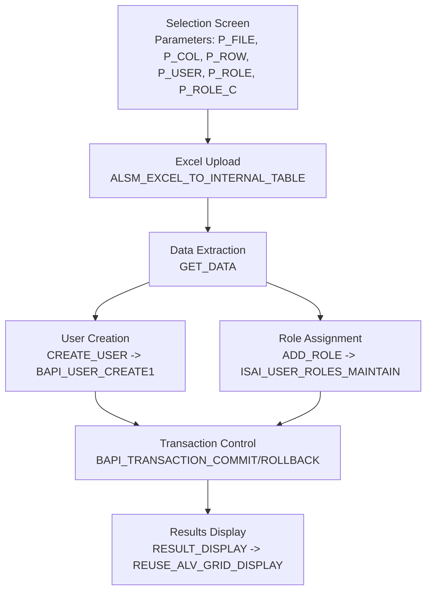
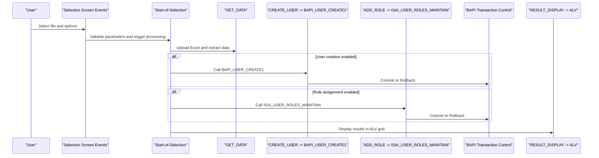
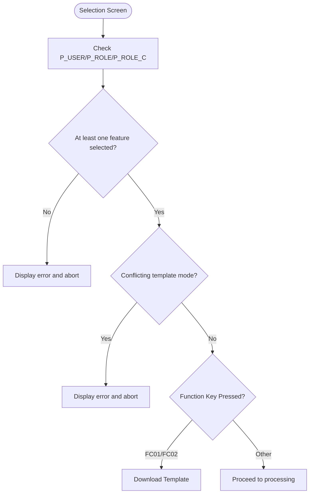
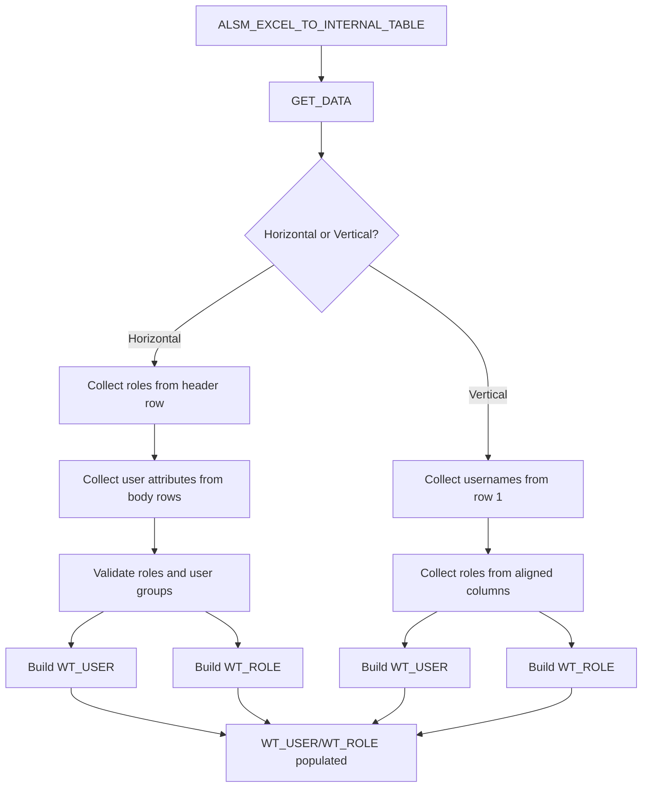
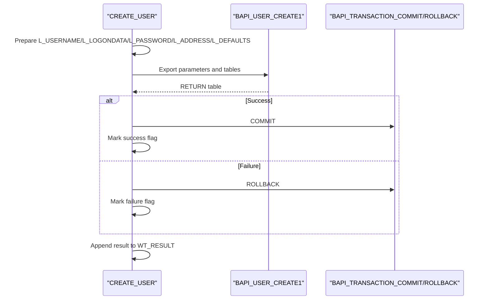
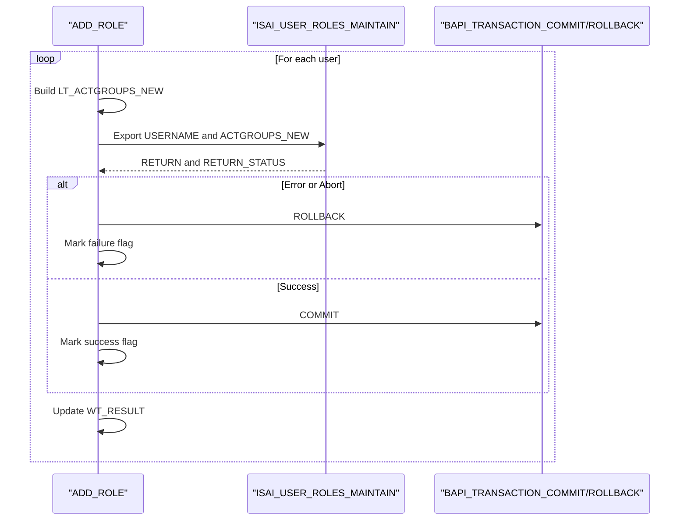
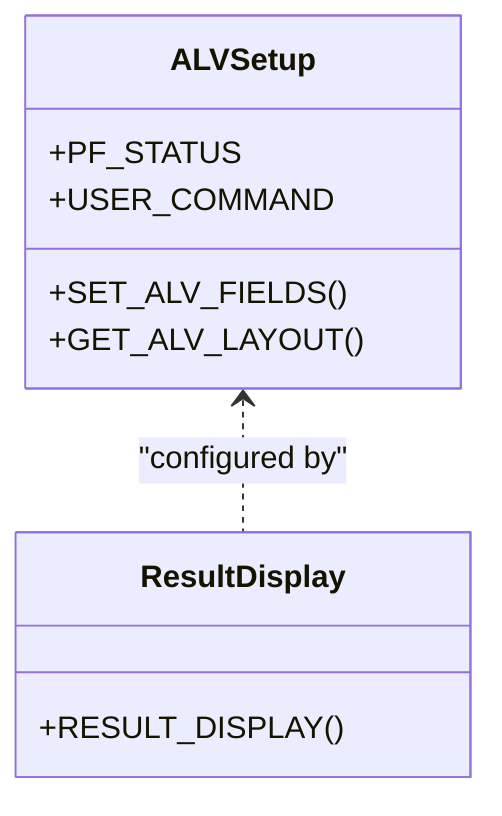
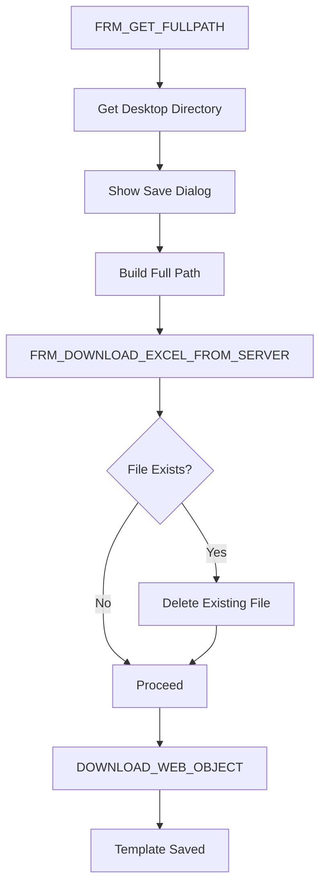
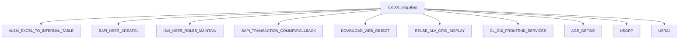

# Enterprise Integration

<cite>
**Referenced Files in This Document**
- [zbc001.prog.abap](file://zbc001.prog.abap)
- [README.MD](file://README.MD)
</cite>

## Table of Contents
1. [Introduction](#introduction)
2. [Project Structure](#project-structure)
3. [Core Components](#core-components)
4. [Architecture Overview](#architecture-overview)
5. [Detailed Component Analysis](#detailed-component-analysis)
6. [Dependency Analysis](#dependency-analysis)
7. [Performance Considerations](#performance-considerations)
8. [Troubleshooting Guide](#troubleshooting-guide)
9. [Conclusion](#conclusion)
10. [Appendices](#appendices)

## Introduction
This document explains the enterprise integration capabilities demonstrated by the ABAP program zbc001.prog.abap. It focuses on SAP system integration concepts, BAPI function calls, and user management automation. The program automates SAP user creation and role assignment by processing Excel templates, integrating SAP BAPIs, and displaying results via ALV. It also illustrates legacy system integration approaches and SAP-specific programming paradigms such as event-driven selection screens, macro-based ALV field configuration, and transactional commit/rollback patterns.

## Project Structure
The repository contains a single ABAP program file that implements the complete integration workflow. The program defines selection-screen parameters, reads an Excel file, transforms data into SAP-compatible structures, calls BAPIs for user creation and role maintenance, and presents results in an ALV grid.

**Diagram sources**
- [zbc001.prog.abap:155-203](file://zbc001.prog.abap#L155-L203)
- [zbc001.prog.abap:208-266](file://zbc001.prog.abap#L208-L266)
- [zbc001.prog.abap:268-328](file://zbc001.prog.abap#L268-L328)
- [zbc001.prog.abap:468-490](file://zbc001.prog.abap#L468-L490)

**Section sources**
- [zbc001.prog.abap:14-14](file://zbc001.prog.abap#L14)
- [zbc001.prog.abap:90-153](file://zbc001.prog.abap#L90-L153)
- [README.MD:21-21](file://README.MD#L21)

## Core Components
- Selection Screen and Parameters
  - File selection parameter and column/row offsets for Excel parsing.
  - Checkboxes to enable user creation and role assignment.
  - Function keys to download Excel templates.
- Data Structures
  - Internal table and structure definitions for user input, results, and roles.
  - SAP-specific BAPI types for logon data, address, defaults, and return messages.
- Excel Template Processing
  - Uploads Excel sheets into internal tables.
  - Supports horizontal and vertical template modes.
  - Validates against existing SAP roles and user groups.
- BAPI Workflows
  - User creation via BAPI_USER_CREATE1 with commit/rollback.
  - Role assignment via ISAI_USER_ROLES_MAINTAIN with commit/rollback.
- Results Presentation
  - ALV grid display with icons and user commands to open SU01.

**Section sources**
- [zbc001.prog.abap:92-97](file://zbc001.prog.abap#L92-L97)
- [zbc001.prog.abap:43-74](file://zbc001.prog.abap#L43-L74)
- [zbc001.prog.abap:169-181](file://zbc001.prog.abap#L169-L181)
- [zbc001.prog.abap:208-266](file://zbc001.prog.abap#L208-L266)
- [zbc001.prog.abap:268-328](file://zbc001.prog.abap#L268-L328)
- [zbc001.prog.abap:468-515](file://zbc001.prog.abap#L468-L515)

## Architecture Overview
The program follows an event-driven ABAP architecture:
- Selection screen events handle parameter validation and template downloads.
- Start-of-selection triggers Excel upload and data extraction.
- End-of-selection displays results via ALV.
- Forms encapsulate reusable logic for user creation, role assignment, ALV layout, and template download.

**Diagram sources**
- [zbc001.prog.abap:135-153](file://zbc001.prog.abap#L135-L153)
- [zbc001.prog.abap:157-194](file://zbc001.prog.abap#L157-L194)
- [zbc001.prog.abap:208-266](file://zbc001.prog.abap#L208-L266)
- [zbc001.prog.abap:268-328](file://zbc001.prog.abap#L268-L328)
- [zbc001.prog.abap:468-490](file://zbc001.prog.abap#L468-L490)

## Detailed Component Analysis

### Selection Screen and Parameter Validation
- Parameters:
  - P_FILE: Excel file path.
  - P_COL/P_ROW: Column and row offsets for parsing.
  - P_USER/P_ROLE/P_ROLE_C: Feature toggles for user creation and role assignment.
- Function Keys:
  - FC01/FC02: Download horizontal/vertical templates.
- Validation:
  - Ensures at least one feature checkbox is selected.
  - Prevents conflicting template modes.

**Diagram sources**
- [zbc001.prog.abap:135-153](file://zbc001.prog.abap#L135-L153)
- [zbc001.prog.abap:136-142](file://zbc001.prog.abap#L136-L142)

**Section sources**
- [zbc001.prog.abap:92-97](file://zbc001.prog.abap#L92-L97)
- [zbc001.prog.abap:114-153](file://zbc001.prog.abap#L114-L153)

### Excel Upload and Data Extraction
- Excel Upload:
  - Uses ALSM_EXCEL_TO_INTERNAL_TABLE to load sheet data into an internal table.
  - Applies column/row offsets based on selected mode.
- Data Extraction:
  - Horizontal mode: Reads header rows for roles and body rows for user attributes and role selections.
  - Vertical mode: Reads user names from row 1 and roles from columns aligned to user indices.
  - Validates roles against AGR_DEFINE and user groups against USGRP.
  - Builds internal tables for users and roles.

**Diagram sources**
- [zbc001.prog.abap:169-181](file://zbc001.prog.abap#L169-L181)
- [zbc001.prog.abap:333-466](file://zbc001.prog.abap#L333-L466)

**Section sources**
- [zbc001.prog.abap:169-181](file://zbc001.prog.abap#L169-L181)
- [zbc001.prog.abap:333-466](file://zbc001.prog.abap#L333-L466)

### User Creation Workflow (BAPI_USER_CREATE1)
- Data Preparation:
  - Maps extracted user fields to BAPI structures (logon data, address, defaults).
- BAPI Call:
  - Calls BAPI_USER_CREATE1 with prepared parameters.
- Transaction Control:
  - Commits on success; rolls back on failure.
- Result Tracking:
  - Captures return messages and flags for display.

**Diagram sources**
- [zbc001.prog.abap:208-266](file://zbc001.prog.abap#L208-L266)

**Section sources**
- [zbc001.prog.abap:208-266](file://zbc001.prog.abap#L208-L266)

### Role Assignment Workflow (ISAI_USER_ROLES_MAINTAIN)
- Data Preparation:
  - Aggregates roles for each user from WT_ROLE.
- BAPI Call:
  - Calls ISAI_USER_ROLES_MAINTAIN with new act groups.
- Transaction Control:
  - Commits on success; rolls back on failure.
- Result Tracking:
  - Captures return status and messages.

**Diagram sources**
- [zbc001.prog.abap:268-328](file://zbc001.prog.abap#L268-L328)

**Section sources**
- [zbc001.prog.abap:268-328](file://zbc001.prog.abap#L268-L328)

### Results Display (ALV Grid)
- ALV Setup:
  - Macro-based field catalog construction for dynamic columns.
  - Layout optimization and checkbox selection support.
- Interaction:
  - User command handler opens SU01 for selected user.
- Save Options:
  - ALV save parameter enabled for layouts.

**Diagram sources**
- [zbc001.prog.abap:525-538](file://zbc001.prog.abap#L525-L538)
- [zbc001.prog.abap:517-523](file://zbc001.prog.abap#L517-L523)
- [zbc001.prog.abap:468-490](file://zbc001.prog.abap#L468-L490)

**Section sources**
- [zbc001.prog.abap:468-515](file://zbc001.prog.abap#L468-L515)
- [zbc001.prog.abap:517-538](file://zbc001.prog.abap#L517-L538)

### Template Download and Frontend Services
- Template Retrieval:
  - Downloads predefined web objects from the SAP system.
  - Validates existence and handles errors.
- Local File Operations:
  - Uses frontend services to get desktop path, show save dialog, check file existence, and delete existing files.
- Path Construction:
  - Builds full path and filename based on user selection.

**Diagram sources**
- [zbc001.prog.abap:567-630](file://zbc001.prog.abap#L567-L630)
- [zbc001.prog.abap:632-722](file://zbc001.prog.abap#L632-L722)

**Section sources**
- [zbc001.prog.abap:540-565](file://zbc001.prog.abap#L540-L565)
- [zbc001.prog.abap:567-630](file://zbc001.prog.abap#L567-L630)
- [zbc001.prog.abap:632-722](file://zbc001.prog.abap#L632-L722)

## Dependency Analysis
- SAP Function Modules
  - ALSM_EXCEL_TO_INTERNAL_TABLE: Excel upload.
  - BAPI_USER_CREATE1: User creation.
  - ISAI_USER_ROLES_MAINTAIN: Role assignment.
  - BAPI_TRANSACTION_COMMIT/ROLLBACK: Transaction control.
  - DOWNLOAD_WEB_OBJECT: Template retrieval.
- ALV and GUI Services
  - REUSE_ALV_GRID_DISPLAY: Results presentation.
  - CL_GUI_FRONTEND_SERVICES: File operations and dialogs.
- Data Access
  - AGR_DEFINE: Role definitions.
  - USGRP: User group definitions.
  - USR21: Existing user list.

**Diagram sources**
- [zbc001.prog.abap:169-181](file://zbc001.prog.abap#L169-L181)
- [zbc001.prog.abap:240-249](file://zbc001.prog.abap#L240-L249)
- [zbc001.prog.abap:291-298](file://zbc001.prog.abap#L291-L298)
- [zbc001.prog.abap:477-489](file://zbc001.prog.abap#L477-L489)
- [zbc001.prog.abap:709-714](file://zbc001.prog.abap#L709-L714)

**Section sources**
- [zbc001.prog.abap:355-362](file://zbc001.prog.abap#L355-L362)

## Performance Considerations
- Batch Processing
  - Looping through users and roles is straightforward but can be optimized by minimizing database reads and using binary search for lookups.
- Transaction Scope
  - Commit/rollback per user/role operation ensures data integrity but may impact performance. Consider batching where feasible.
- ALV Rendering
  - Field optimization and minimal column count improve rendering speed.
- File I/O
  - Avoid repeated frontend service calls; cache paths and filenames when possible.

## Troubleshooting Guide
- Excel Upload Failures
  - Verify file path and permissions; ensure the Excel file is not locked by another process.
- Role Validation Errors
  - Confirm role names exist in AGR_DEFINE; ensure user groups exist in USGRP.
- Template Download Errors
  - Ensure the web object exists in the system; use transaction SMW0 to load the template if missing.
- Transaction Rollbacks
  - Review return messages from BAPIs to identify causes; ensure proper cleanup on failures.
- ALV Display Issues
  - Check field catalog construction and layout settings; verify ALV save parameter configuration.

**Section sources**
- [zbc001.prog.abap:159-162](file://zbc001.prog.abap#L159-L162)
- [zbc001.prog.abap:405-409](file://zbc001.prog.abap#L405-L409)
- [zbc001.prog.abap:442-446](file://zbc001.prog.abap#L442-L446)
- [zbc001.prog.abap:663-667](file://zbc001.prog.abap#L663-L667)
- [zbc001.prog.abap:258-260](file://zbc001.prog.abap#L258-L260)

## Conclusion
The ABAP program demonstrates a practical enterprise integration example that automates SAP user management through Excel-driven workflows. It integrates SAP BAPIs for user creation and role assignment, validates data against SAP dictionaries, and presents results via ALV. The solution showcases ABAP programming patterns, transaction control, and legacy system integration via Excel uploads and web object downloads.

## Appendices
- SAP-Specific Programming Paradigms
  - Event-driven selection screens, macro-based ALV field catalogs, and transactional BAPI workflows.
- Enterprise Integration Challenges
  - Data validation, transaction integrity, and user experience across heterogeneous systems.
- Educational Example Highlights
  - Demonstrates reusable forms, parameterized templates, and interactive ALV grids for operational feedback.