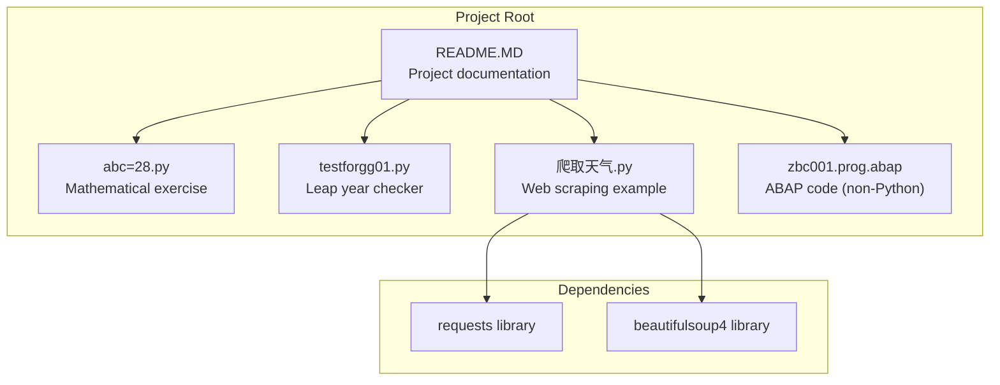

# Getting Started

<cite>
**Referenced Files in This Document**
- [README.MD](file://README.MD)
- [abc=28.py](file://abc=28.py)
- [testforgg01.py](file://testforgg01.py)
- [爬取天气.py](file://爬取天气.py)
</cite>

## Table of Contents
1. [Introduction](#introduction)
2. [Prerequisites and Learning Path](#prerequisites-and-learning-path)
3. [Environment Setup](#environment-setup)
4. [Dependency Installation](#dependency-installation)
5. [Running the Scripts](#running-the-scripts)
6. [Verification Steps](#verification-steps)
7. [Troubleshooting Guide](#troubleshooting-guide)
8. [Project Structure Overview](#project-structure-overview)
9. [Conclusion](#conclusion)

## Introduction
This guide helps you set up a Python 3.x development environment and run the scripts in this study project. The project includes three learning-focused Python scripts: a mathematical algorithm exercise, a leap year checker, and a web scraping example using HTTP requests and HTML parsing. The goal is to provide step-by-step instructions for installation, dependency setup, and script execution, along with troubleshooting tips and verification steps.

## Prerequisites and Learning Path
Before starting, ensure you have:
- Basic computer literacy and familiarity with command-line interfaces
- A working internet connection for downloading Python and packages
- Administrative rights to install software on your machine

Recommended learning sequence:
1. Install and verify Python 3.x
2. Install required dependencies using pip
3. Run the basic scripts (mathematical exercise and leap year checker)
4. Run the web scraping script and understand network requests and HTML parsing
5. Review the README for project structure and usage notes

## Environment Setup
Follow these steps to prepare your environment:

1. **Install Python 3.x**
   - Download Python 3.x from the official website
   - During installation, ensure you select "Add Python to PATH" to enable global access
   - Complete the installation wizard

2. **Verify Python Installation**
   - Open a new terminal/command prompt
   - Type the Python version command to confirm installation
   - Confirm the interpreter path is accessible globally

3. **Set Up a Virtual Environment (Optional but Recommended)**
   - Create a dedicated environment for this project
   - Activate the environment before installing dependencies
   - This isolates project dependencies from your system

4. **Configure Your Editor or IDE**
   - Use a code editor that supports Python (e.g., VS Code, PyCharm)
   - Ensure the editor recognizes the Python interpreter you installed
   - Configure syntax highlighting and linting if desired

**Section sources**
- [README.MD:30-34](file://README.MD#L30-L34)
- [README.MD:36-51](file://README.MD#L36-L51)

## Dependency Installation
The project requires two Python libraries:
- requests: for making HTTP requests
- beautifulsoup4: for parsing HTML content

Install dependencies using pip:
- Open a terminal/command prompt in the project directory
- Run the pip install command to install both libraries
- Verify installation completes without errors

Notes:
- The installation command is provided in the project README
- Ensure you are connected to the internet during installation
- If you encounter permission errors, run the command with elevated privileges or use the user flag for local installation

**Section sources**
- [README.MD:26-28](file://README.MD#L26-L28)
- [README.MD:30-34](file://README.MD#L30-L34)

## Running the Scripts
Execute each script using the Python interpreter from the command line. Navigate to the project directory and run the following commands:

1. **Run the Mathematical Exercise Script**
   - Command: python abc=28.py
   - Purpose: Demonstrates loops, conditions, and palindrome checking
   - Expected behavior: Outputs results computed by the script

2. **Run the Leap Year Checker Script**
   - Command: python testforgg01.py
   - Purpose: Implements leap year logic with test cases
   - Expected behavior: Prints results for various years

3. **Run the Web Scraping Script**
   - Command: python 爬取天气.py
   - Purpose: Fetches weather data from a Chinese weather website
   - Expected behavior: Prints city weather information if successful

Important considerations:
- Ensure dependencies are installed before running the scraping script
- The scraping script makes HTTP requests; network connectivity is required
- Some websites may change their HTML structure, affecting parsing

**Section sources**
- [README.MD:36-51](file://README.MD#L36-L51)
- [abc=28.py:1-33](file://abc=28.py#L1-L33)
- [testforgg01.py:1-21](file://testforgg01.py#L1-L21)
- [爬取天气.py:1-36](file://爬取天气.py#L1-L36)

## Verification Steps
After completing setup, verify everything works correctly:

1. **Python Installation Verification**
   - Check Python version in the terminal
   - Confirm the interpreter path is accessible globally

2. **Dependency Verification**
   - Attempt to import both libraries in a Python session
   - Ensure no import errors occur

3. **Script Execution Verification**
   - Run each script individually and observe output
   - Compare outputs with expected results described in the project

4. **Network Connectivity Verification (for scraping)**
   - Test HTTP access to the target website
   - Ensure firewall or proxy settings allow outbound connections

5. **File Encoding Verification**
   - Confirm the script filename encoding is supported by your system
   - Ensure special characters in filenames are handled correctly

**Section sources**
- [README.MD:30-34](file://README.MD#L30-L34)
- [README.MD:36-51](file://README.MD#L36-L51)

## Troubleshooting Guide
Common issues and solutions:

### Python Installation Issues
- Problem: Command not found or wrong Python version
  - Solution: Reinstall Python 3.x and ensure "Add to PATH" is selected
  - Verify by checking the Python version in a new terminal

- Problem: Permission errors during installation
  - Solution: Run the installer as administrator or use a user-only installation

### Dependency Installation Problems
- Problem: pip not recognized
  - Solution: Add Python's Scripts directory to PATH or use python -m pip

- Problem: Network timeouts during installation
  - Solution: Use a stable internet connection or configure pip to use a mirror

- Problem: Import errors for requests or beautifulsoup4
  - Solution: Reinstall dependencies and verify they appear in your Python environment

### Script Execution Issues
- Problem: UnicodeDecodeError or encoding issues
  - Solution: Ensure your terminal supports UTF-8 encoding
  - Verify file encoding and system locale settings

- Problem: ModuleNotFoundError for requests or beautifulsoup4
  - Solution: Confirm dependencies are installed in the same environment as your Python interpreter

- Problem: Network-related errors when running the scraping script
  - Solution: Check internet connectivity and firewall settings
  - Verify the target website is accessible from your location

### Cross-Platform Considerations
- Windows users: Ensure the command prompt supports UTF-8 if running scripts with non-ASCII filenames
- macOS/Linux users: Verify executable permissions if running scripts directly
- Virtual environments: Ensure the environment is activated before running scripts

**Section sources**
- [README.MD:30-34](file://README.MD#L30-L34)
- [README.MD:36-51](file://README.MD#L36-L51)
- [README.MD:61-66](file://README.MD#L61-L66)

## Project Structure Overview
The project consists of four files with distinct learning objectives:

**Diagram sources**
- [README.MD:5-22](file://README.MD#L5-L22)
- [README.MD:26-28](file://README.MD#L26-L28)

Key characteristics:
- Three Python scripts for different learning objectives
- Two external dependencies for web scraping functionality
- Mixed file types including ABAP code for reference
- Clear separation between educational scripts and supporting documentation

**Section sources**
- [README.MD:5-22](file://README.MD#L5-L22)

## Conclusion
You now have the essential information to set up your Python development environment and run all scripts in this study project. The mathematical exercise and leap year checker provide foundational programming practice, while the web scraping script introduces HTTP requests and HTML parsing. Follow the verification steps to ensure everything works correctly, and use the troubleshooting section to resolve common issues. Continue exploring Python fundamentals by experimenting with these scripts and gradually adding more complex functionality.