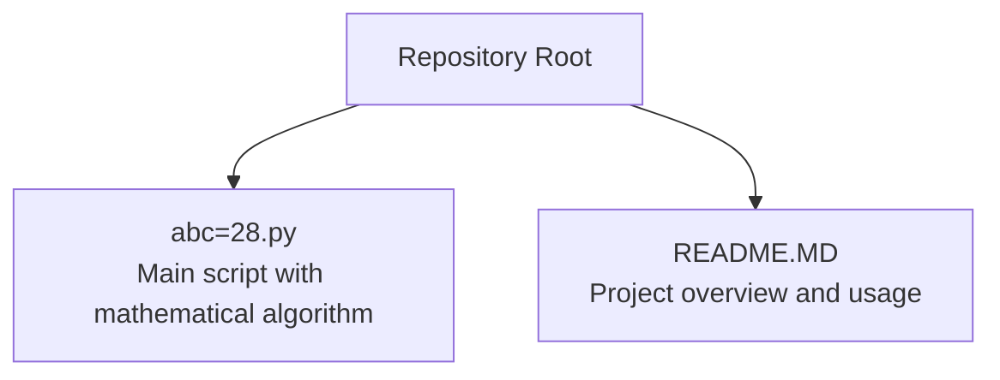
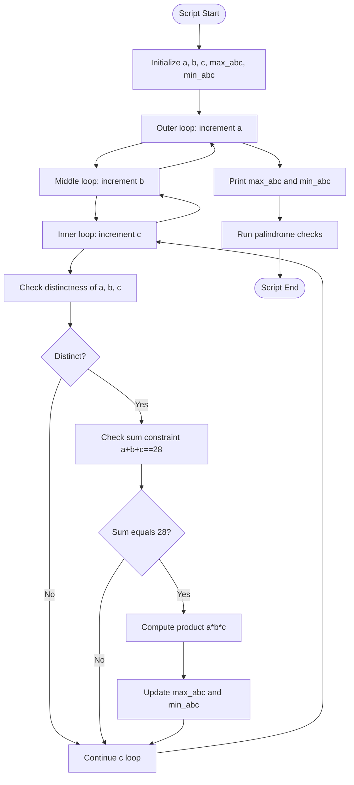
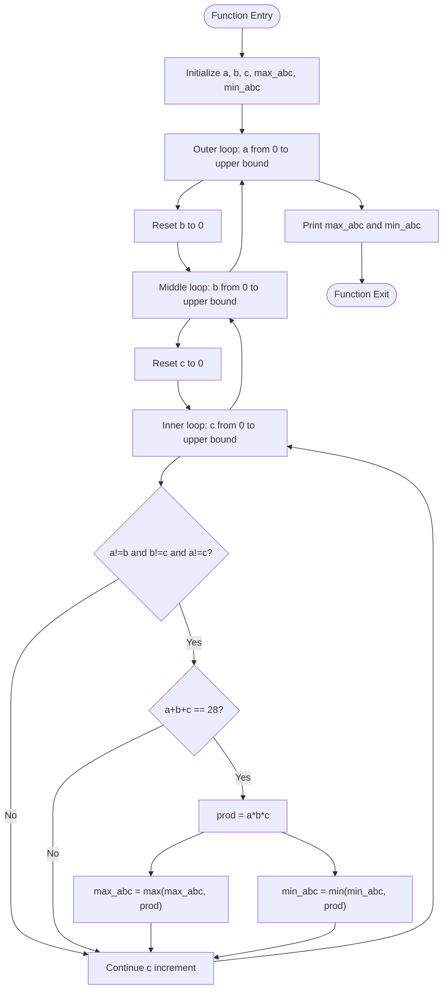
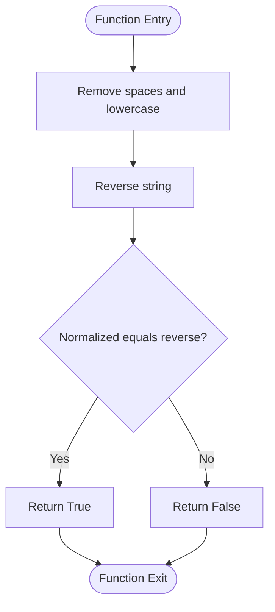

# Mathematical Algorithms

<cite>
**Referenced Files in This Document**
- [abc=28.py](file://abc=28.py)
- [README.MD](file://README.MD)
</cite>

## Table of Contents
1. [Introduction](#introduction)
2. [Project Structure](#project-structure)
3. [Core Components](#core-components)
4. [Architecture Overview](#architecture-overview)
5. [Detailed Component Analysis](#detailed-component-analysis)
6. [Dependency Analysis](#dependency-analysis)
7. [Performance Considerations](#performance-considerations)
8. [Troubleshooting Guide](#troubleshooting-guide)
9. [Conclusion](#conclusion)

## Introduction
This document presents a focused analysis of the mathematical algorithms implemented in the abc=28.py script. The script solves a constrained optimization problem: finding all combinations of three distinct digits that sum to a target value and computing the maximum and minimum products among those combinations. It also includes a palindrome detection function for educational purposes. The analysis covers algorithmic design, loop structures, pruning strategies, and performance characteristics, with emphasis on the mathematical reasoning underlying the solution approach.

## Project Structure
The project is a small learning-oriented repository containing standalone Python scripts. The abc=28.py script is the primary focus, with a secondary palindrome-checking function appended for demonstration.

**Diagram sources**
- [abc=28.py](file://abc=28.py)
- [README.MD](file://README.MD)

**Section sources**
- [README.MD:1-67](file://README.MD#L1-L67)

## Core Components
- Three-number combination generator with constraints:
  - Variables a, b, c represent the three distinct digits.
  - Nested loops iterate over candidate values up to an upper bound.
  - Pruning conditions enforce distinctness and the sum constraint.
  - Running computations track the maximum and minimum products.
- Palindrome detection function:
  - Normalizes input by removing spaces and lowercasing.
  - Compares the normalized string to its reverse to determine palindromicity.

Key implementation references:
- Loop initialization and bounds: [abc=28.py:1-5](file://abc=28.py#L1-L5)
- Outer loop and increment logic: [abc=28.py:7-10](file://abc=28.py#L7-L10)
- Middle loop and increment logic: [abc=28.py:11-14](file://abc=28.py#L11-L14)
- Inner loop and increment logic: [abc=28.py:15](file://abc=28.py#L15)
- Distinctness checks: [abc=28.py:16-17](file://abc=28.py#L16-L17)
- Sum constraint check: [abc=28.py:18](file://abc=28.py#L18)
- Product update logic: [abc=28.py:20-23](file://abc=28.py#L20-L23)
- Palindrome function definition and usage: [abc=28.py:26-32](file://abc=28.py#L26-L32)

**Section sources**
- [abc=28.py:1-33](file://abc=28.py#L1-L33)

## Architecture Overview
The script follows a straightforward functional architecture:
- Global scope initializes counters and bounds.
- Nested loops enumerate candidate combinations.
- Constraint checks prune invalid candidates early.
- Aggregate updates maintain running extremes of the product.
- A separate function handles string normalization and palindrome verification.

**Diagram sources**
- [abc=28.py:1-24](file://abc=28.py#L1-L24)
- [abc=28.py:26-32](file://abc=28.py#L26-L32)

## Detailed Component Analysis

### Three-Number Combination Problem
The script addresses a constrained optimization problem:
- Objective: maximize and minimize the product of three distinct digits under the constraint that their sum equals the target value.
- Domain: digits represented by integer variables a, b, c, each bounded above by an upper limit consistent with the sum constraint.

Algorithmic approach:
- Brute-force enumeration via nested loops.
- Early pruning using distinctness and sum checks.
- Running updates to global maximum and minimum products.

Mathematical reasoning:
- For fixed sum S, the product of three positive integers is maximized when the values are as close as possible to each other (by AM-GM inequality intuition).
- Conversely, the product is minimized when the values are as far apart as possible while maintaining distinctness and sum equality.

Implementation highlights:
- Variable initialization and bounds: [abc=28.py:1-5](file://abc=28.py#L1-L5)
- Loop structure and increments: [abc=28.py:7-15](file://abc=28.py#L7-L15)
- Distinctness enforcement: [abc=28.py:16-17](file://abc=28.py#L16-L17)
- Sum constraint enforcement: [abc=28.py:18](file://abc=28.py#L18)
- Product computation and extreme updates: [abc=28.py:20-23](file://abc=28.py#L20-L23)

**Diagram sources**
- [abc=28.py:1-24](file://abc=28.py#L1-L24)

**Section sources**
- [abc=28.py:1-24](file://abc=28.py#L1-L24)

### Palindrome Detection Function
The palindrome function demonstrates string normalization and reversal comparison:
- Normalization removes spaces and converts to lowercase.
- Comparison checks equality between the normalized string and its reverse.

Implementation highlights:
- Normalization and reversal: [abc=28.py:27](file://abc=28.py#L27)
- Equality check: [abc=28.py:28](file://abc=28.py#L28)
- Usage examples: [abc=28.py:30-32](file://abc=28.py#L30-L32)

**Diagram sources**
- [abc=28.py:26-28](file://abc=28.py#L26-L28)

**Section sources**
- [abc=28.py:26-32](file://abc=28.py#L26-L32)

## Dependency Analysis
- Internal dependencies:
  - The main algorithm relies on basic arithmetic and comparison operators.
  - The palindrome function depends on string manipulation and slicing.
- No external library imports are present in the script.

Coupling and cohesion:
- The script maintains low coupling by keeping the algorithm and helper function separate.
- Cohesion is strong within each component (algorithmic computation and string processing).

Potential improvements:
- Encapsulate the algorithm in a function to improve reusability and testing.
- Add input validation and clearer bounds for the digit variables.

**Section sources**
- [abc=28.py:1-33](file://abc=28.py#L1-L33)

## Performance Considerations
- Time complexity:
  - The nested loops iterate over a bounded domain, resulting in O(N^3) complexity where N is the upper bound for each digit.
  - Early pruning via distinctness and sum checks reduces the effective search space.
- Space complexity:
  - The script uses a constant amount of memory for counters and intermediate values.
- Optimization opportunities:
  - Reduce search space by enforcing ordering (e.g., a < b < c) to eliminate permutations.
  - Precompute and cache sums to avoid repeated arithmetic.
  - Use mathematical insights to derive candidate sets more efficiently.

Algorithmic thinking patterns:
- Brute-force enumeration with pruning is a reliable baseline for small domains.
- Symmetry breaking (ordering constraints) can significantly reduce iterations.
- Mathematical optimization (AM-GM-like reasoning) guides expectations for extreme values.

[No sources needed since this section provides general guidance]

## Troubleshooting Guide
Common issues and resolutions:
- Incorrect bounds:
  - Ensure the upper bound for digits is consistent with the sum constraint to avoid missing valid solutions.
  - Verify loop termination conditions to prevent infinite loops.
- Distinctness errors:
  - Confirm that all pairwise distinctness checks are in place to avoid duplicate or invalid combinations.
- Product overflow:
  - For larger domains, consider using appropriate numeric types to handle large products.
- Output interpretation:
  - Validate that the printed results correspond to the intended target sum and distinctness constraints.

Validation steps:
- Manually verify a few representative combinations satisfy the sum and distinctness criteria.
- Cross-check extreme products against known optimal configurations derived from mathematical reasoning.

**Section sources**
- [abc=28.py:16-23](file://abc=28.py#L16-L23)

## Conclusion
The abc=28.py script exemplifies a practical approach to solving a constrained optimization problem through brute-force enumeration with targeted pruning. Its structure cleanly separates the core algorithm from a supporting utility function, making it accessible for learning and experimentation. While the current implementation is efficient for small domains, applying symmetry-breaking and mathematical insights can further enhance performance and scalability. The inclusion of a palindrome function adds educational value by demonstrating string processing techniques alongside the mathematical optimization routine.