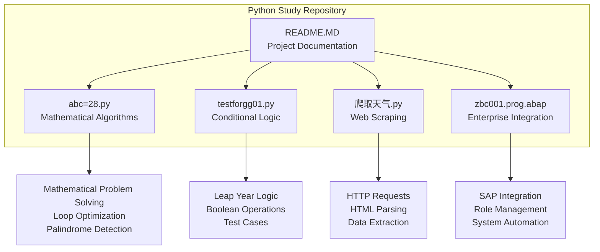
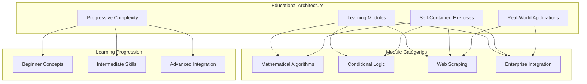
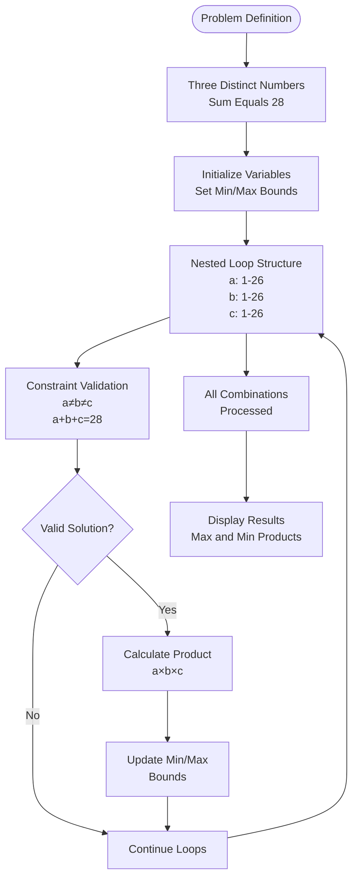
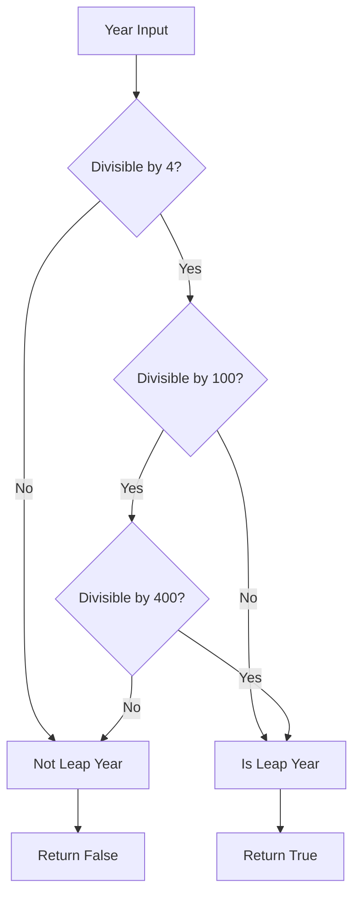
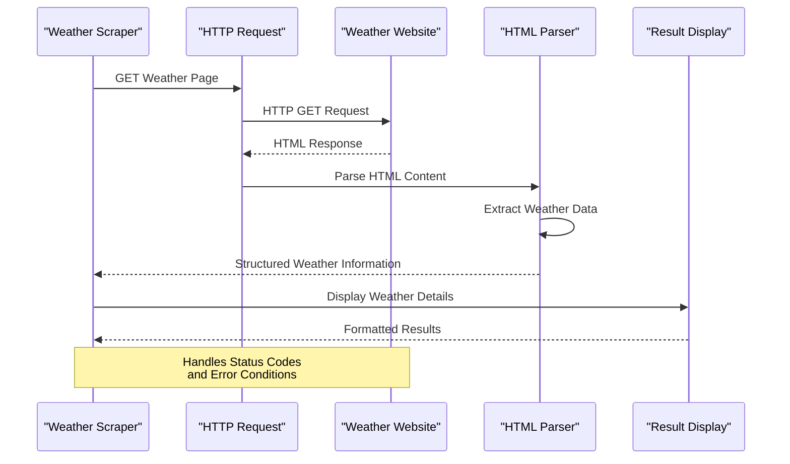
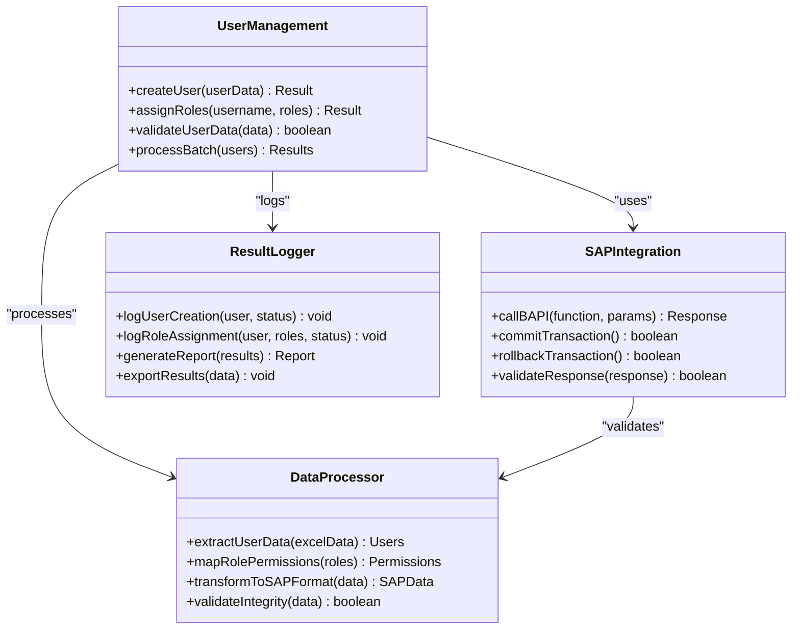
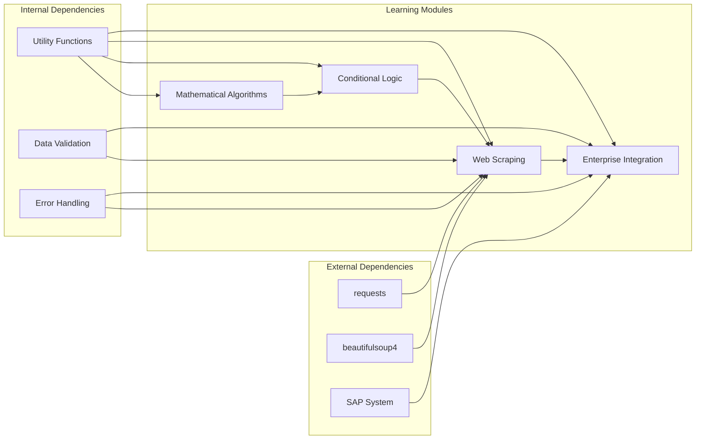

# Project Overview

<cite>
**Referenced Files in This Document**
- [README.MD](file://README.MD)
- [abc=28.py](file://abc=28.py)
- [testforgg01.py](file://testforgg01.py)
- [爬取天气.py](file://爬取天气.py)
- [zbc001.prog.abap](file://zbc001.prog.abap)
</cite>

## Table of Contents
1. [Introduction](#introduction)
2. [Project Structure](#project-structure)
3. [Core Components](#core-components)
4. [Architecture Overview](#architecture-overview)
5. [Detailed Component Analysis](#detailed-component-analysis)
6. [Dependency Analysis](#dependency-analysis)
7. [Performance Considerations](#performance-considerations)
8. [Troubleshooting Guide](#troubleshooting-guide)
9. [Conclusion](#conclusion)

## Introduction
This Python Study project is an educational learning platform designed to help beginners to intermediate developers practice and master fundamental Python programming concepts through hands-on exercises. The project emphasizes progressive complexity and self-contained learning modules, allowing learners to build confidence by starting with basic concepts and gradually advancing to more sophisticated topics. Each script serves a specific learning goal, focusing on practical skills such as loops and conditionals, function definition and usage, network scraping, and real-world integration patterns.

The project's educational philosophy centers on incremental difficulty and focused practice. Learners progress from simple arithmetic and logical checks to more complex tasks like web scraping and enterprise integration. The modular approach ensures that each exercise can be understood independently while contributing to a broader understanding of Python programming.

## Project Structure
The repository contains four primary scripts organized around distinct learning domains:

**Diagram sources**
- [README.MD:5-21](file://README.MD#L5-L21)
- [abc=28.py:1-33](file://abc=28.py#L1-L33)
- [testforgg01.py:1-21](file://testforgg01.py#L1-L21)
- [爬取天气.py:1-36](file://爬取天气.py#L1-L36)
- [zbc001.prog.abap:1-723](file://zbc001.prog.abap#L1-L723)

**Section sources**
- [README.MD:5-21](file://README.MD#L5-L21)

## Core Components
The project consists of four main components, each targeting specific programming competencies:

### Mathematical Algorithms Module
The mathematical algorithms component focuses on problem-solving through computational methods. It demonstrates loop optimization techniques, constraint satisfaction problems, and string manipulation for palindrome detection. The module teaches learners how to systematically explore solution spaces while applying mathematical constraints.

Key learning objectives include:
- Loop nesting and optimization strategies
- Constraint-based problem solving
- String processing and normalization
- Algorithmic thinking and brute-force approaches

### Conditional Logic Module
The conditional logic module centers on leap year determination, teaching fundamental boolean operations and logical reasoning. It introduces learners to compound conditions, modulo arithmetic, and systematic testing approaches. The module emphasizes proper function design with clear documentation and comprehensive test coverage.

Learning outcomes encompass:
- Boolean logic construction
- Modular function design
- Test-driven development practices
- Edge case consideration

### Web Scraping Module
The web scraping component introduces HTTP communication, HTML parsing, and structured data extraction. Learners gain experience with external APIs, response handling, and data transformation techniques. The module covers essential networking concepts and robust error handling for production environments.

Skills developed include:
- HTTP request/response cycles
- HTML/XML parsing strategies
- Data extraction patterns
- Error handling and validation

### Enterprise Integration Module
The enterprise integration component demonstrates SAP system interaction, role management automation, and batch processing workflows. This module bridges academic learning with real-world enterprise scenarios, showing how Python can integrate with legacy systems and automate administrative tasks.

Competencies addressed:
- SAP BAPI integration patterns
- Role-based access control automation
- Batch data processing
- System interface design

**Section sources**
- [README.MD:7-21](file://README.MD#L7-L21)
- [abc=28.py:1-33](file://abc=28.py#L1-L33)
- [testforgg01.py:1-21](file://testforgg01.py#L1-L21)
- [爬取天气.py:1-36](file://爬取天气.py#L1-L36)
- [zbc001.prog.abap:1-723](file://zbc001.prog.abap#L1-L723)

## Architecture Overview
The project follows a modular architecture where each script operates as an independent learning module while sharing common educational principles:

The architecture ensures that learners can progress from foundational concepts to advanced applications while maintaining focus on specific skill areas. Each module can be studied independently, allowing flexible learning paths tailored to individual interests and skill levels.

## Detailed Component Analysis

### Mathematical Algorithms Analysis
The mathematical algorithms component demonstrates systematic problem-solving through computational methods. The implementation showcases nested loop optimization, constraint satisfaction, and string processing techniques.

**Diagram sources**
- [abc=28.py:7-24](file://abc=28.py#L7-L24)

The palindrome detection function illustrates string normalization and comparison techniques, teaching learners about whitespace removal, case conversion, and efficient string reversal patterns.

**Section sources**
- [abc=28.py:1-33](file://abc=28.py#L1-L33)

### Conditional Logic Analysis
The conditional logic module focuses on leap year determination, demonstrating proper function design and comprehensive testing strategies.

**Diagram sources**
- [testforgg01.py:3-12](file://testforgg01.py#L3-L12)

The module includes comprehensive test cases covering various scenarios including century years and edge cases, demonstrating best practices for validation and verification.

**Section sources**
- [testforgg01.py:1-21](file://testforgg01.py#L1-L21)

### Web Scraping Analysis
The web scraping component demonstrates HTTP communication and HTML parsing using industry-standard libraries.

**Diagram sources**
- [爬取天气.py:4-36](file://爬取天气.py#L4-L36)

The implementation covers essential scraping concepts including request headers, response validation, and structured data extraction from HTML elements.

**Section sources**
- [爬取天气.py:1-36](file://爬取天气.py#L1-L36)

### Enterprise Integration Analysis
The enterprise integration component demonstrates SAP system interaction and role management automation, showcasing real-world integration patterns.

**Diagram sources**
- [zbc001.prog.abap:206-328](file://zbc001.prog.abap#L206-L328)

The module demonstrates advanced integration patterns including transaction management, error handling, and batch processing workflows.

**Section sources**
- [zbc001.prog.abap:1-723](file://zbc001.prog.abap#L1-L723)

## Dependency Analysis
The project maintains loose coupling between modules while sharing common educational principles:

**Diagram sources**
- [README.MD:26-28](file://README.MD#L26-L28)

Each module maintains independence while benefiting from shared validation and error handling patterns, supporting the project's educational philosophy of progressive complexity.

**Section sources**
- [README.MD:26-34](file://README.MD#L26-L34)

## Performance Considerations
The project emphasizes practical performance characteristics for each learning domain:

- **Mathematical Algorithms**: Focus on algorithmic efficiency and loop optimization
- **Conditional Logic**: Emphasis on clear branching logic and minimal computational overhead
- **Web Scraping**: Considerations for rate limiting and resource management
- **Enterprise Integration**: Transaction management and system responsiveness

## Troubleshooting Guide
Common issues and solutions across modules:

- **Web Scraping Issues**: Network connectivity, website structure changes, and rate limiting
- **Enterprise Integration Problems**: System availability, permission issues, and transaction failures
- **Data Processing Errors**: Format validation, encoding issues, and data integrity checks
- **Testing Challenges**: Comprehensive test coverage and edge case validation

**Section sources**
- [README.MD:61-67](file://README.MD#L61-L67)

## Conclusion
This Python Study project provides a comprehensive educational framework that bridges fundamental programming concepts with real-world applications. Through its four core modules—mathematical algorithms, conditional logic, web scraping, and enterprise integration—the project offers a structured learning path suitable for beginners to intermediate developers. The progressive complexity approach ensures steady skill development while the self-contained nature of each module allows flexible learning experiences. By combining theoretical understanding with practical implementation, the project prepares learners for both academic advancement and professional software development challenges.