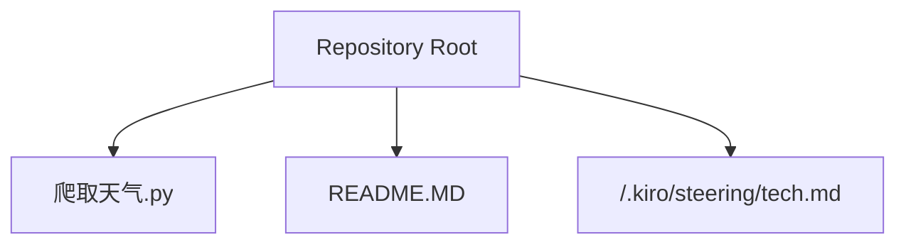
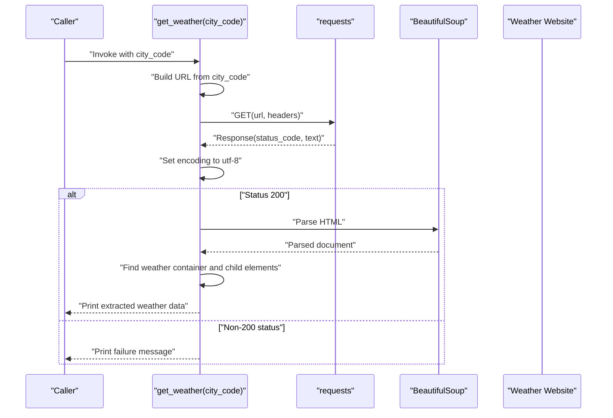
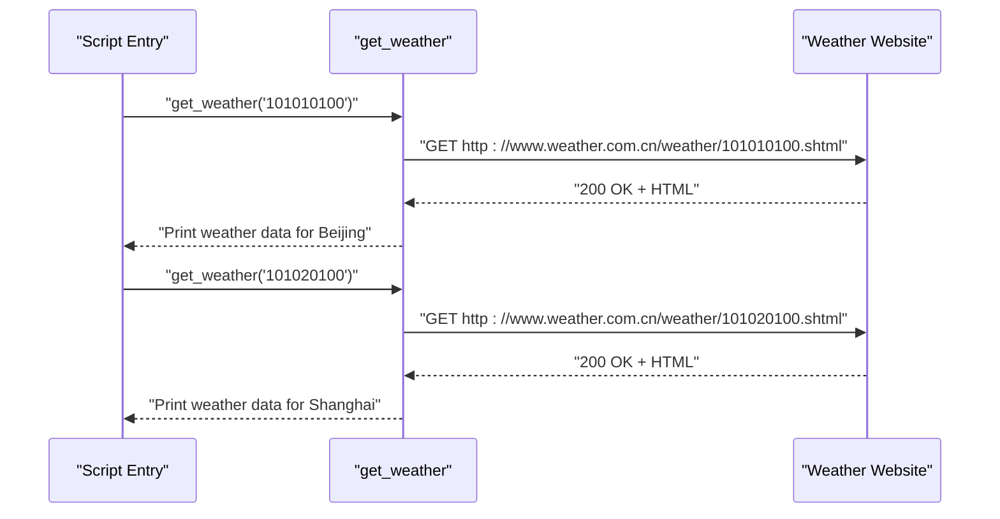
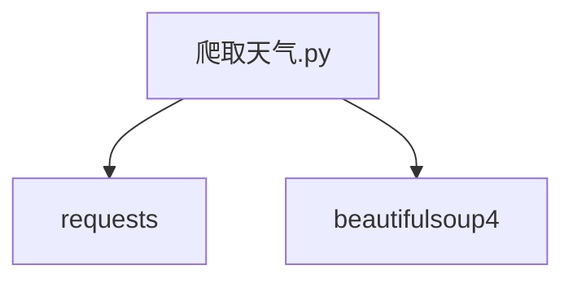

# Web Scraping

<cite>
**Referenced Files in This Document**
- [爬取天气.py](file://爬取天气.py)
- [README.MD](file://README.MD)
- [.kiro/steering/tech.md](file://.kiro/steering/tech.md)
</cite>

## Table of Contents
1. [Introduction](#introduction)
2. [Project Structure](#project-structure)
3. [Core Components](#core-components)
4. [Architecture Overview](#architecture-overview)
5. [Detailed Component Analysis](#detailed-component-analysis)
6. [Dependency Analysis](#dependency-analysis)
7. [Performance Considerations](#performance-considerations)
8. [Troubleshooting Guide](#troubleshooting-guide)
9. [Conclusion](#conclusion)
10. [Appendices](#appendices)

## Introduction
This document provides comprehensive guidance for the web scraping implementation in the 爬取天气.py script. It focuses on HTTP request handling using the requests library, proper header configuration, and error handling strategies. It also explains HTML parsing techniques using BeautifulSoup, element selection, and data extraction methods. The document covers the weather data retrieval process, including URL construction, response handling, and data processing. Additionally, it outlines best practices for web scraping, including ethical considerations, robots.txt compliance, and server load management, along with common challenges, error handling patterns, and data validation techniques.

## Project Structure
The project is a small learning-oriented Python study repository containing several scripts and documentation. The web scraping example resides in a single Python file and is accompanied by a README that documents installation, usage, and general notes.

**Diagram sources**
- [README.MD:1-67](file://README.MD#L1-L67)
- [.kiro/steering/tech.md:1-50](file://.kiro/steering/tech.md#L1-L50)

**Section sources**
- [README.MD:1-67](file://README.MD#L1-L67)
- [.kiro/steering/tech.md:1-50](file://.kiro/steering/tech.md#L1-L50)

## Core Components
- HTTP client and parser libraries:
  - requests: Used to send HTTP GET requests to the target weather website.
  - beautifulsoup4: Used to parse HTML and extract structured data.
- Weather retrieval function:
  - Accepts a city code, constructs a URL, sends a request with a configured User-Agent header, checks the response status, parses the HTML, and extracts weather attributes (date, weather condition, temperature, wind).
- Example usage:
  - Demonstrates fetching weather for two predefined city codes.

Key implementation references:
- Import statements and library usage: [爬取天气.py:1-2](file://爬取天气.py#L1-L2)
- Function definition and URL construction: [爬取天气.py:4-5](file://爬取天气.py#L4-L5)
- Header configuration: [爬取天气.py:6-8](file://爬取天气.py#L6-L8)
- Request sending and encoding: [爬取天气.py:10-11](file://爬取天气.py#L10-L11)
- Status check and parsing: [爬取天气.py:13-14](file://爬取天气.py#L13-L14)
- Element selection and data extraction: [爬取天气.py:17-24](file://爬取天气.py#L17-L24)
- Output and fallback messages: [爬取天气.py:26-32](file://爬取天气.py#L26-L32)
- Example invocations: [爬取天气.py:35-36](file://爬取天气.py#L35-L36)

**Section sources**
- [爬取天气.py:1-36](file://爬取天气.py#L1-L36)

## Architecture Overview
The web scraping pipeline follows a straightforward flow: construct a URL from a city code, send an HTTP GET request with a browser-like User-Agent header, validate the response, parse the HTML, locate the relevant weather container, and extract specific elements for date, weather condition, temperature, and wind.

**Diagram sources**
- [爬取天气.py:4-32](file://爬取天气.py#L4-L32)

## Detailed Component Analysis

### HTTP Request Handling and Headers
- URL construction:
  - The function builds a URL using a city code placeholder embedded in the path segment.
  - Reference: [爬取天气.py:5](file://爬取天气.py#L5)
- Header configuration:
  - A User-Agent header is set to mimic a modern browser, reducing the chance of being blocked or served restricted content.
  - Reference: [爬取天气.py:6-8](file://爬取天气.py#L6-L8)
- Request sending and encoding:
  - The GET request is sent with the configured headers.
  - The response encoding is explicitly set to UTF-8 to ensure proper text decoding.
  - References: [爬取天气.py:10](file://爬取天气.py#L10), [爬取天气.py:11](file://爬取天气.py#L11)
- Status handling:
  - The function checks the HTTP status code and proceeds only on success.
  - References: [爬取天气.py:13](file://爬取天气.py#L13), [爬取天气.py:31-32](file://爬取天气.py#L31-L32)

Best practices demonstrated:
- Explicitly setting encoding to avoid garbled text.
- Using a realistic User-Agent header to improve compatibility with target servers.

Common pitfalls to avoid:
- Not setting encoding can lead to incorrect character rendering.
- Sending requests without a User-Agent may trigger server-side restrictions.

**Section sources**
- [爬取天气.py:4-32](file://爬取天气.py#L4-L32)

### HTML Parsing and Data Extraction
- Parsing:
  - The response text is parsed into a BeautifulSoup object using the HTML parser.
  - Reference: [爬取天气.py:14](file://爬取天气.py#L14)
- Container selection:
  - The script locates the primary weather container by its tag and class.
  - Reference: [爬取天气.py:17](file://爬取天气.py#L17)
- Child element extraction:
  - The first child item is selected to represent today’s weather.
  - Date, weather condition, temperature, and wind are extracted from nested elements.
  - Reference: [爬取天气.py:19-24](file://爬取天气.py#L19-L24)
- Output:
  - Extracted values are printed in a formatted message.
  - Reference: [爬取天气.py:26](file://爬取天气.py#L26)
- Fallback handling:
  - If the container or child element is missing, a message is printed indicating the absence of data.
  - References: [爬取天气.py:28-30](file://爬取天气.py#L28-L30)

Validation and robustness:
- Existence checks for containers and elements prevent runtime errors when elements are missing.
- Stripping whitespace from temperature text ensures clean output.

**Section sources**
- [爬取天气.py:14-26](file://爬取天气.py#L14-L26)
- [README.MD:16-19](file://README.MD#L16-L19)

### Function Call Flow and Example Usage
- Function invocation:
  - The script demonstrates calling the function with two city codes.
  - References: [爬取天气.py:35-36](file://爬取天气.py#L35-L36)
- Example output:
  - The function prints a formatted line containing city code, date, weather condition, temperature, and wind.

**Diagram sources**
- [爬取天气.py:35-36](file://爬取天气.py#L35-L36)

## Dependency Analysis
The script depends on external libraries for HTTP communication and HTML parsing. The README and tech documentation outline the required dependencies and installation steps.

**Diagram sources**
- [爬取天气.py:1-2](file://爬取天气.py#L1-L2)
- [README.MD:26-28](file://README.MD#L26-L28)
- [.kiro/steering/tech.md:8-9](file://.kiro/steering/tech.md#L8-L9)

**Section sources**
- [README.MD:26-34](file://README.MD#L26-L34)
- [.kiro/steering/tech.md:8-34](file://.kiro/steering/tech.md#L8-L34)

## Performance Considerations
- Network latency and bandwidth:
  - Each request incurs network overhead; batching multiple city codes in a loop increases total time.
- Parsing cost:
  - BeautifulSoup parsing is efficient for moderate HTML sizes but can be optimized by limiting unnecessary DOM traversal.
- Concurrency:
  - For larger datasets, consider asynchronous requests or thread pools to reduce total execution time.
- Caching:
  - Cache responses locally to avoid repeated requests for the same city codes during development or testing.
- Rate limiting:
  - Add delays between requests to reduce server load and avoid throttling or blocking.

[No sources needed since this section provides general guidance]

## Troubleshooting Guide
Common issues and resolutions:
- HTTP status failures:
  - If the status code is not 200, the function prints a failure message. Investigate network connectivity, URL correctness, and server availability.
  - Reference: [爬取天气.py:31-32](file://爬取天气.py#L31-L32)
- Missing elements:
  - If the weather container or child element is absent, the function prints a message indicating missing data. Verify the selector and site structure.
  - References: [爬取天气.py:28-30](file://爬取天气.py#L28-L30)
- Encoding problems:
  - If characters appear garbled, ensure the response encoding is set to UTF-8.
  - Reference: [爬取天气.py:11](file://爬取天气.py#L11)
- Robots.txt and policies:
  - Respect the website’s robots.txt and terms of service. Limit request frequency to avoid overloading the server.
  - Reference: [README.MD:63-65](file://README.MD#L63-L65)

**Section sources**
- [爬取天气.py:11, 28-32](file://爬取天气.py#L11,L28-L32)
- [README.MD:63-65](file://README.MD#L63-L65)

## Conclusion
The 爬取天气.py script demonstrates a practical, minimal web scraping workflow: constructing a URL, sending an HTTP request with a realistic header, validating the response, parsing HTML, selecting elements, and extracting structured data. It includes basic error handling and fallback messaging. For production-grade scraping, expand the script with robust retry logic, exponential backoff, concurrency controls, and caching. Always adhere to ethical guidelines, robots.txt compliance, and responsible server load management.

[No sources needed since this section summarizes without analyzing specific files]

## Appendices
- Installation and usage:
  - Install dependencies and run the script as documented in the README.
  - References: [README.MD:30-34](file://README.MD#L30-L34), [README.MD:48-51](file://README.MD#L48-L51)

**Section sources**
- [README.MD:30-34](file://README.MD#L30-L34)
- [README.MD:48-51](file://README.MD#L48-L51)